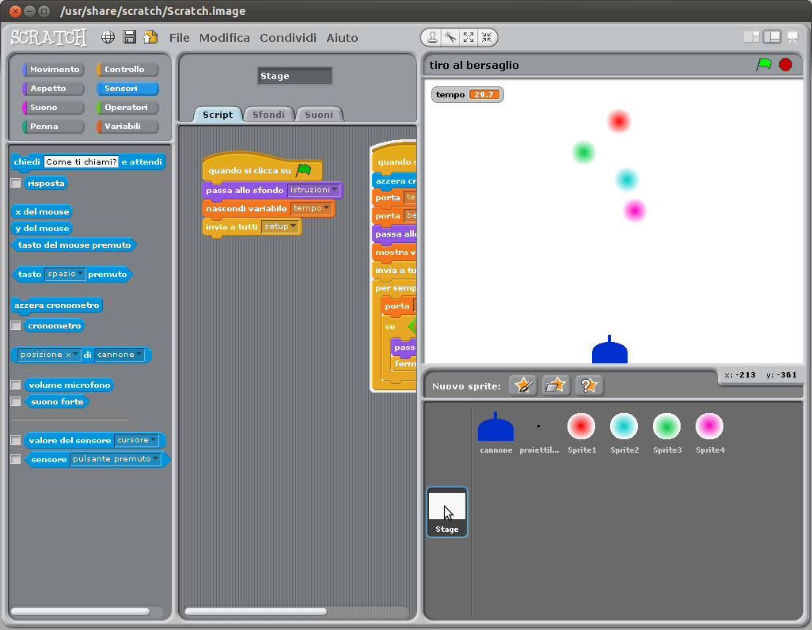

Tiro al bersaglio
=================

Esempio di programma in ambiente Scratch 1.4 (dovrebbe funzionare anche in ambiente 2.0) per insegnare la programmazione a bambini

##Variazioni

<strike>Inserire un numero massimo di colpi da sparare</strike>

##Screenshot

